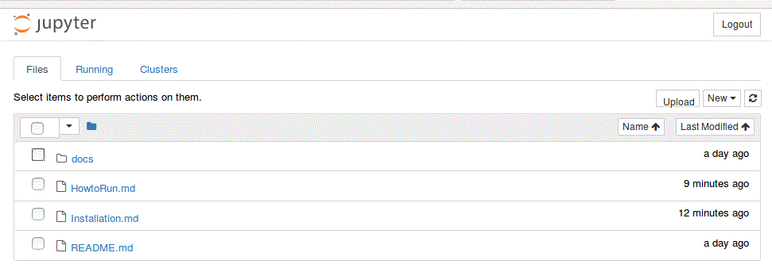

# Notebook 실행하기

 ## 첫 걸음 
  1. 다음 명령어를 통해 Notebook 서버를 시작하세요 :

	$ jupyter notebook

  2. 브라우저에 Notebook이 실행된 것을 확인할 수 있습니다.

# Notebook 서버 시작하기
 
  Notebook을 컴퓨터에 설치하였으면 Notebook 서버를 시작할 수 있습니다. 다음 명령어를 이용하여 Notebook서버를 시작할 수 있습니다.

 $ jupyter notebook

 이 명령어를 실행하면, 터미널에 웹 응용프로그램의 주소와 서버에 대한 정보가 출력됩니다.

 $ jupyter notebook
  [I 08:58:24.417 NotebookApp] Serving notebooks from local directory: /Users/catherline
  [I 08:58:24.417 NotebookApp] 0 active kernels
  [I 08:58:24.417 NotebookApp] The Jupyter Notebook is running at: http://localhost:8888/
  [I 08:58:24.417 NotebookApp] Use Control-C to stop this server and shut down all kernels

 기본 브라우저를 통해 이 주소가 열립니다.

 Notebook이 브라우저에 열리면, Notebook의 목록을 보여주는 Notebook Dashboard를 볼 수 있습니다. 대체로 가장 상위의 디렉토리를 열어줄 것입니다. 

 **Notebook Dashboard**

# Notebook 서버의 명령어 소개

 ## 커스텀 IP 나 포트를 이용하여 시작하려면 어떻게 해야할까?
  
 기본값으로, Notebook 서버는 포트 8888로 시작됩니다. 만약 포트8888이 사용할 수 없다면, Notebook 서버는 다른 가능한 포트를 찾습니다. 또한 임의로 포트를 설정해주는 것도 가능합니다. 예를 들어 포트 9999로 실행하면 :
 
 $jupyter notebook --port 9999

 ## 브라우저를 열지않고 Notebook를 열기

 브라우저를 열지 않고 Notebook 서버를 시작하려면 :

 $jupyter notebook --no-browser

 
 ## Notebook 서버 옵션 도움말 보기

 Notebook 서버는 --help 옵션을 통해 도움말 메시지를 제공합니다 :

 $jupyter notebook --help

 

