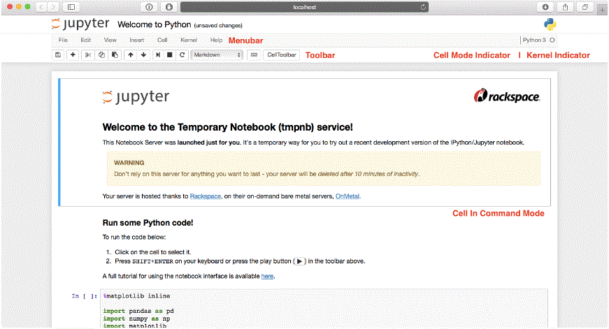
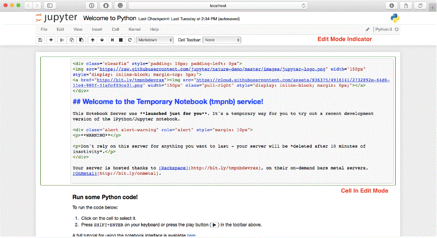
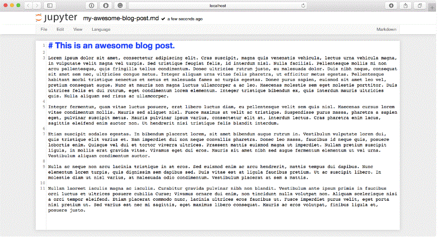

#UI 기능

버그 리포트나 Jupyter Mailing list에 메일을 보내려고 할 때, 개발자나 사용자들이 버그를 진단하거나 해결해줄 경우 다른 UI를 사용하면 시간이 단축된다.
이번 장에서는 Notebook과 Notebook의 다른 모드의 UI 요소를 알려줄 것이다.

##Notebook Dashboard

jupyter notebook 명령어를 실행하면 가장 먼저  Notebook Dashboard가 나타난다.

##Notebook 편집기

편집을 위해 Notebook을 선택했다면, Notebook은 Notebook편집기를 열어준다.

##Notebook 의 사용자 도움 인터페이스

만약 Notebook 편집기의 특정 요소를 더 배우고 싶다면, 도움 메뉴 - 사용자 인터페이스 를 선택함으로써 사용사 인터페이스 도움말을 볼 수 있습니다.

##편집 모드와 Notebook편집기

셀이 편집모드에 있다면, 셀 모드 지시자는 셀의 상태를 반영합니다. 이 상태는 오른쪽 위의 작은 연필모양으로 선택가능합니다. 셀이 명령 모드에 있다면, 그 위치에 아이콘이 없습니다.

##파일 편집기

이제 Notebook Dashboard 안의 Notebook 파일이 아닌 표시된 파일을 선택하여 열어야한다고 한다면, 파일은 파일 편집기로 열립니다.

